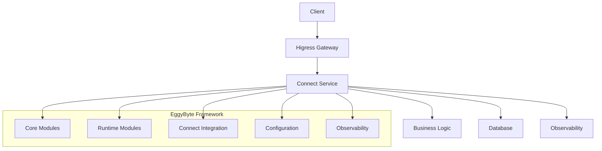

<div align="center">

# 🥚 EggyByte Go Microservices Framework

[](https://golang.org/)
[](https://opensource.org/licenses/MIT)
[](https://goreportcard.com/report/github.com/eggybyte-technology/egg)
[](https://github.com/eggybyte-technology/egg/actions)

**A modern, production-ready Go microservices framework with Connect-first architecture**

[📖 Documentation](docs/) • [🚀 Quick Start](#-quick-start) • [📋 Examples](examples/) • [🤝 Contributing](#-contributing)

</div>

---

## ✨ Features

<table>
<tr>
<td width="50%">

### 🎯 **Core Principles**
- **Ultra-thin core** + pluggable satellite libraries
- **Connect-first** architecture with unified interceptor stack
- **Zero business intrusion** - focus on your domain logic
- **Production-ready** with observability built-in

</td>
<td width="50%">

### 🚀 **Key Capabilities**
- **Unified port strategy** - single port for HTTP/Connect/gRPC-Web
- **K8s-native** configuration with hot updates
- **Layered authentication** model
- **Stable API** with semantic versioning

</td>
</tr>
</table>

### 🏗️ **Architecture Highlights**



- **🔧 Core Modules**: Zero-dependency interfaces and utilities
- **⚡ Runtime Modules**: Service lifecycle and infrastructure
- **🔗 Connect Integration**: Protocol support and interceptors
- **⚙️ Configuration**: Hot updates and validation
- **📊 Observability**: Metrics, tracing, and logging

## 🚀 Quick Start

### Prerequisites

- **Go 1.21+** - [Download](https://golang.org/dl/)
- **Docker** - [Download](https://www.docker.com/get-started)
- **Make** (optional) - For development workflows

### Installation

```bash
# Clone the repository
git clone https://github.com/eggybyte-technology/egg.git
cd egg

# Build all modules and examples
./scripts/build.sh all

# Deploy services (one-click)
./scripts/deploy.sh up
```

### Verify Installation

```bash
# Check service health
./scripts/deploy.sh health

# View service logs
./scripts/deploy.sh logs

# Access services
curl http://localhost:8081/health  # Minimal service
curl http://localhost:8083/health  # User service
```

### 🧪 Testing

```bash
# Run comprehensive tests
./scripts/test.sh all

# Test CLI functionality
./scripts/test.sh cli

# Test production workflows
./scripts/test.sh production
```

## 📁 Project Structure

```
egg/
├── 📦 core/                    # L1: Zero-dependency interfaces and utilities (stable)
│   ├── identity/              # 🔐 Identity container and permission checks
│   ├── errors/                # ⚠️ Structured error handling
│   ├── log/                   # 📝 Logging interface
│   └── utils/                 # 🛠️ Common utility functions
├── ⚡ runtimex/               # L2: Runtime kernel
├── 🔗 connectx/               # L3: Connect binding + unified interceptors
├── ⚙️ configx/                # L3: Unified configuration management
├── 📊 obsx/                   # L3: OpenTelemetry integration
├── ☸️ k8sx/                   # L3: Kubernetes integration
├── 🗄️ storex/                 # L3: Database integration
├── 🚀 deploy/                 # Unified deployment configuration
│   ├── docker-compose.yaml
│   ├── otel-collector-config.yaml
│   ├── Dockerfile.minimal
│   └── Dockerfile.user
├── 🔧 scripts/                # Build and deployment scripts
│   ├── build.sh              # Build script
│   ├── deploy.sh             # Deployment script
│   ├── test.sh               # Test script
│   ├── test-cli.sh           # CLI test script
│   └── test-cli-production.sh # Production test script
├── 🎯 cli/                    # Command-line interface
└── 📋 examples/              # Example projects
    ├── minimal-connect-service/
    └── user-service/
```

### 🏗️ Module Architecture

| Layer | Module | Purpose | Stability |
|-------|--------|---------|-----------|
| **L1** | `core/` | Zero-dependency interfaces | 🔒 Stable |
| **L2** | `runtimex/` | Runtime kernel | 🔒 Stable |
| **L3** | `connectx/`, `configx/`, `obsx/`, `k8sx/`, `storex/` | Infrastructure modules | 🔄 Evolving |

## 📚 Module Documentation

### 🔧 Core Modules (L1 - Stable)

| Module | Description | Documentation |
|--------|-------------|---------------|
| [`core/identity`](core/identity/) | 🔐 User identity and request metadata management | [README](core/identity/README.md) |
| [`core/errors`](core/errors/) | ⚠️ Structured error handling with codes | [README](core/errors/README.md) |
| [`core/log`](core/log/) | 📝 Structured logging interface | [README](core/log/README.md) |
| [`core/utils`](core/utils/) | 🛠️ Common utility functions | [README](core/utils/README.md) |

### ⚡ Runtime Modules (L2/L3)

| Module | Description | Documentation |
|--------|-------------|---------------|
| [`runtimex`](runtimex/) | ⚡ Service lifecycle management | [README](runtimex/README.md) |
| [`connectx`](connectx/) | 🔗 Connect protocol support and interceptors | [README](connectx/README.md) |
| [`configx`](configx/) | ⚙️ Configuration management and hot updates | [README](configx/README.md) |
| [`obsx`](obsx/) | 📊 OpenTelemetry integration | [README](obsx/README.md) |
| [`k8sx`](k8sx/) | ☸️ Kubernetes integration | [README](k8sx/README.md) |
| [`storex`](storex/) | 🗄️ Database integration | [README](storex/README.md) |

### 🎯 Tools

| Module | Description | Documentation |
|--------|-------------|---------------|
| [`cli`](cli/) | 🎯 Command-line interface for project management | [README](cli/README.md) |

## ⚙️ Configuration Management

The framework uses a unified configuration management system that supports:

- 🔧 **Environment variable** configuration
- 🔄 **Configuration file** hot updates
- ☸️ **Kubernetes ConfigMap** monitoring
- ✅ **Configuration validation** and default values

### Base Configuration

```go
type BaseConfig struct {
    ServiceName    string `env:"SERVICE_NAME" default:"app"`
    ServiceVersion string `env:"SERVICE_VERSION" default:"0.0.0"`
    Env            string `env:"ENV" default:"dev"`
    HTTPPort       string `env:"HTTP_PORT" default:":8080"`
    HealthPort     string `env:"HEALTH_PORT" default:":8081"`
    MetricsPort    string `env:"METRICS_PORT" default:":9091"`
}
```

### Business Configuration

```go
type AppConfig struct {
    configx.BaseConfig
    
    // Business-specific configuration
    Database DatabaseConfig
    Business BusinessConfig
    Features FeatureConfig
}
```

## 🛠️ Service Development

### 🚀 Quick Service Creation

```bash
# Use the CLI to create a new service
./cli/egg create backend my-service

# Build and deploy
./scripts/build.sh service examples/my-service my-service
./scripts/deploy.sh up
```

### 📝 Manual Service Implementation

```go
func main() {
    // Initialize logger
    logger := &SimpleLogger{}
    
    // Create context
    ctx, cancel := context.WithCancel(context.Background())
    defer cancel()
    
    // Initialize configuration manager
    configManager, err := configx.DefaultManager(ctx, logger)
    if err != nil {
        logger.Error(err, "Failed to initialize configuration manager")
        os.Exit(1)
    }
    
    // Load configuration
    var cfg AppConfig
    if err := configManager.Bind(&cfg); err != nil {
        logger.Error(err, "Failed to bind configuration")
        os.Exit(1)
    }
    
    // Create HTTP mux
    mux := http.NewServeMux()
    
    // Setup Connect interceptors
    interceptors := connectx.DefaultInterceptors(connectx.Options{
        Logger:            logger,
        WithRequestBody:   cfg.EnableDebugLogs,
        WithResponseBody:  cfg.EnableDebugLogs,
        SlowRequestMillis: cfg.SlowRequestMillis,
        PayloadAccounting: true,
    })
    
    // Create Connect handler
    service := &YourService{}
    path, handler := yourv1connect.NewYourServiceHandler(
        service, 
        connect.WithInterceptors(interceptors...),
    )
    
    // Bind handler
    mux.Handle(path, handler)
    
    // Start runtime
    err = runtimex.Run(ctx, nil, runtimex.Options{
        Logger: logger,
        HTTP: &runtimex.HTTPOptions{
            Addr: cfg.HTTPPort,
            H2C:  true,
            Mux:  mux,
        },
        Health:  &runtimex.Endpoint{Addr: cfg.HealthPort},
        Metrics: &runtimex.Endpoint{Addr: cfg.MetricsPort},
        ShutdownTimeout: 15 * time.Second,
    })
    
    if err != nil {
        logger.Error(err, "Runtime failed")
        os.Exit(1)
    }
}
```

### 🔐 Identity and Permission Checks

```go
func (s *YourService) YourMethod(ctx context.Context, req *connect.Request[YourRequest]) (*connect.Response[YourResponse], error) {
    // Check user identity
    if user, ok := identity.UserFrom(ctx); ok {
        logger.Info("User request", log.Str("user_id", user.UserID))
    }
    
    // Permission check
    if !identity.HasRole(ctx, "admin") {
        return nil, connect.NewError(connect.CodePermissionDenied, errors.New("PERMISSION_DENIED", "admin role required"))
    }
    
    // Business logic
    // ...
    
    return connect.NewResponse(response), nil
}
```

## 🚀 Deployment

### 🐳 Docker Compose Deployment

```bash
# One-click deployment
./scripts/deploy.sh up

# Check service status
./scripts/deploy.sh status

# View logs
./scripts/deploy.sh logs

# Stop services
./scripts/deploy.sh down
```

### 🌐 Service Endpoints

| Service | URL | Description |
|---------|-----|-------------|
| **Minimal Service** | http://localhost:8080 | Connect service example |
| **User Service** | http://localhost:8082 | Database-backed service |
| **Jaeger UI** | http://localhost:16686 | Distributed tracing |
| **Prometheus Metrics** | http://localhost:8889/metrics | Metrics collection |
| **MySQL** | localhost:3306 | Database |

## 🧪 Testing

### 🔬 Unit Tests

```bash
# Run all tests
go test ./...

# Run tests with coverage report
go test -coverprofile=coverage.out ./...
go tool cover -html=coverage.out
```

### 🔗 Integration Tests

```bash
# Full workflow tests
./scripts/test.sh all

# Test CLI functionality
./scripts/test.sh cli

# Test production workflows
./scripts/test.sh production

# Test specific services
curl http://localhost:8081/health
curl http://localhost:8083/health
```

## 📖 Development Guide

### 🆕 Adding New Modules

1. **Create module directory** in root
2. **Initialize Go module**: `go mod init github.com/eggybyte-technology/egg/module-name`
3. **Update `go.work`** file
4. **Implement functionality** with tests
5. **Add documentation** and examples

### 📋 Adding New Examples

1. **Create example** in `examples/` directory
2. **Initialize Go module** with proper dependencies
3. **Implement example code** following patterns
4. **Update build scripts** and deployment config
5. **Test thoroughly** with integration tests

### ⚙️ Configuration Best Practices

- ✅ Use `configx.BaseConfig` as base configuration
- ✅ Provide default values through environment variables
- ✅ Support configuration hot updates
- ✅ Use structured configuration validation
- ✅ Document all configuration options

## 🤝 Contributing

We welcome contributions! Please see our [Contributing Guide](CONTRIBUTING.md) for details.

### Quick Start for Contributors

1. **Fork** the repository
2. **Create** a feature branch: `git checkout -b feature/amazing-feature`
3. **Commit** your changes: `git commit -m 'Add amazing feature'`
4. **Push** to the branch: `git push origin feature/amazing-feature`
5. **Open** a Pull Request

### Development Setup

```bash
# Clone your fork
git clone https://github.com/your-username/egg.git
cd egg

# Install dependencies
go mod download

# Run tests
./scripts/test.sh all

# Build and deploy
./scripts/build.sh all
./scripts/deploy.sh up
```

## 📄 License

This project is licensed under the **MIT License** - see the [LICENSE](LICENSE) file for details.

## 🆘 Support

Need help? We're here for you!

- 📖 **Documentation**: [docs/](docs/)
- 🐛 **Bug Reports**: [GitHub Issues](https://github.com/eggybyte-technology/egg/issues)
- 💬 **Discussions**: [GitHub Discussions](https://github.com/eggybyte-technology/egg/discussions)
- 📧 **Email**: [support@eggybyte.com](mailto:support@eggybyte.com)

---

<div align="center">

**Made with ❤️ by the EggyByte Team**

[⭐ Star us on GitHub](https://github.com/eggybyte-technology/egg) • [🐦 Follow us on Twitter](https://twitter.com/eggybyte) • [💼 Visit our website](https://eggybyte.com)

</div>